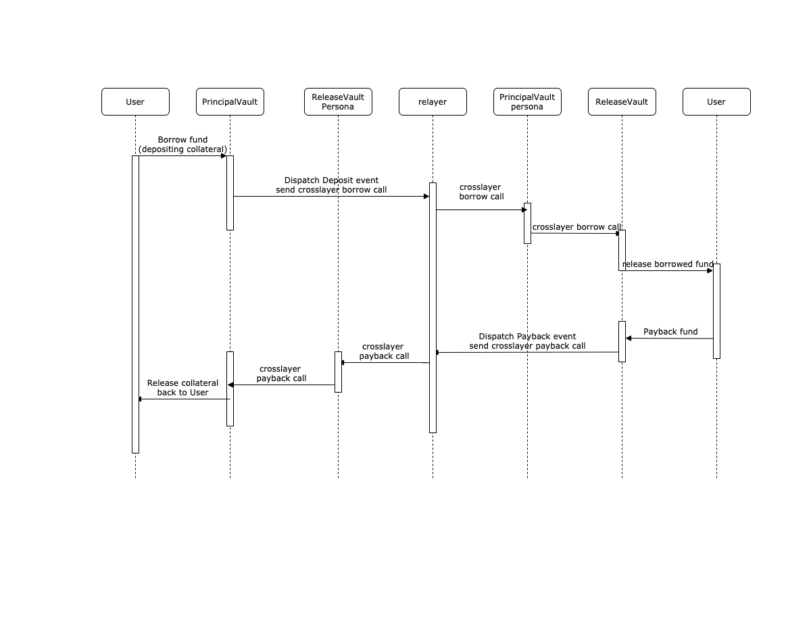

# DEMO 
In this demo, we are going to show how to interact with Mosaice crosslayer functionalities to provide collateral on one network and borrow fund using another network
## Preparation and instantiation of contracts.
For this demo, we have implemented a pair of Vault contracts which will be deployed in 2 different networks. The idea is to allow user deposit collateral in network 1 and automatically receive borrowed fund in a second network
Htere are steps need to prepare the contracts: 

* Deploy ```PrincipalVault``` contract in Network 1
   ```
   const relayer = ""; //relayer address
   const baseToken = ""; //collateral token address
   const msgSender = ""; //msgsender address which will receive cross layer function calls located in network 1
  
   const principalVault = await PrincialVault.deploy(relayer, baseToken, msgSender);
   ```

* Deploy ```PrincipalVault``` ```Persona``` contract in network 2, so PrincipalVault could communicate with ReleaseVault without intermediary
   ```
   const principalVault = ""; 
   const principalVaultPersona = await MsgReceiverFactory.createPersona(principalVault)
   ```
  
* Deploy ```ReleaseVault``` contract in Network 2
   ```
   const relayer = ""; //relayer address
   const releaseToken = ""; //lending token to be sent to user in network 2
   const msgSender = ""; //msgsender address which will receive cross layer function calls located in network 2
   const principalVault = ""; //principalVault address located in 1
   const chainId = ""; //chainId of network 1
   const principalVaultPersona = ""; //principalVault Persona address deployed in l2
  
   releaseVault = await releaseVault.deploy(relayer, releaseToken, msgSender, principalVault, chainId, principalVaultPersona)
   ```

* Deploy ```ReleaseVault``` ```Persona``` contract in network 1, so ReleaseVault could send messages to PrincipalVault ithout intermediary
   ```
   const releaseVault = "" // releasse vault address
   const releaseVaultPersona = await MsgReceiverFactory.createPersona(releaseVault)
   const principalVaultPersona = await MsgReceiverFactory.createPersona(principalVault.address)
   ```
  
* Configure in principalVault to set corresponding releaseVault and releaseVault Persona contract to finalize the communication bridges setup
   ```
   const releaseVault = "" // releasse vault address deployed in network l2
   const releaseVaultPersona = "" // releasse vault persona address deployed in network 1
   await principalVault.setReleaseVaultAddressByChainId(networkId2, relaseVault) 
   await principalVault.setReleaseVaultAddressPersona(releaseVaultPersona, releaseVault);
   ```
* Now all communication bridges are configured, sending messages between principalVault and releaseVault can be done seamlessly, from the contract perspectives operative permissions are configured in a way that only Persona contracts could interact to.
   ```
   // PrincipalVault contract
   function payback(uint256 _amount, address _to) external onlyReleaseVaultPersona;
   
   // ReleaseVault contract
   function borrow(uint256 _amount, address _to) external onlyPrincipalVaultPersona;
   ```

### Interaction
In the following flow chart we can see how we start a transaction from network 1 to make a deposit of certain erc20 token as collateral, and automatically get borrowed asset in network 2.

