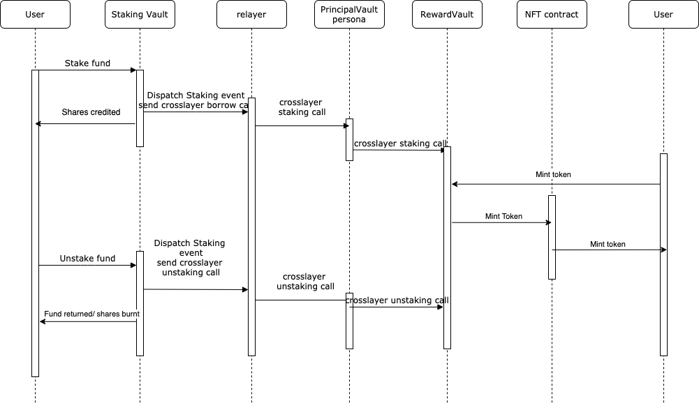

# DEMO 
In this demo, we are going to show how to interact with Mosaice crosslayer functionalities to stake on one network and mint NFT token in another network using staking rewards.
## Preparation and instantiation of contracts.
For this demo, we have implemented a pair of Stacking and NFT Reward Vault contracts which will be deployed in 2 different networks. The idea is to allow user deposit collateral in network 1 and receive staking rewards in a second network
Here are steps need to prepare the contracts: 

* Deploy ```NFTStakingVault``` contract in Network 1
   ```
   const baseToken = ""; //staking token address
   const msgSender = ""; //msgsender address which will receive cross layer function calls located in network 1
  
   const stakingVault = await NFTStackingVault.deploy(baseToken, msgSender);
   ```

* Deploy ```NFTStakinglVault``` ```Persona``` contract in network 2, so NFTStakingVault could communicate with NFTRewardsVault without intermediary
   ```
   const stakingVault = ""; 
   const stakingVaultPersona = await MsgReceiverFactory.createPersona(stakingVault)
   ```
  
* Deploy ```NFTRewardsVault``` contract in Network 2
   ```
   const msgSender = ""; //msgsender address which will receive cross layer function calls located in network 2
   const stakingVaultPersona = ""; //stakingVault Persona address deployed in l2
  
   releaseVault = await releaseVault.deploy(msgSender, stakingVaultPersona)
   ```
* Internally  ```NFTRewardsVault``` will create a NFT contract.

* Configure in stakingVault to set corresponding rewardVault to finalize the communication bridges setup
   ```
   const rewardVault = "" // releasse vault address deployed in network l2
   await stakingVault.setRewardVaultAddressByChainId(networkId1, rewardVault) 
   ```
  
* Now all communication bridges are configured, sending messages from stakingVault to rewardVault can be done seamlessly, from the contract perspectives operative permissions are configured in a way that only Persona contracts could interact to.
   ```
   // NFTRewardVault contract
   function stake(uint256 _amount, address _to) external onlyReleaseVaultPersona;
   
   // NFTRewardVault contract
   function unstake(uint256 _amount, address _to) external onlyStakingVaultPersona;
   ```
  
* User could mint a NFT by spending the rewards points:
   ```
   // NFTRewardVault contract
   function mint(uint256 _tokenId, address _to);
   ```
   

### Interaction
In the following flow chart we can see how we start a transaction from network 1 to make a deposit of certain erc20 token as staking token, then user could accumulate his rewards points as long as the staking token remains in the staking contract, and spend his rewards points to mint NFT token.

