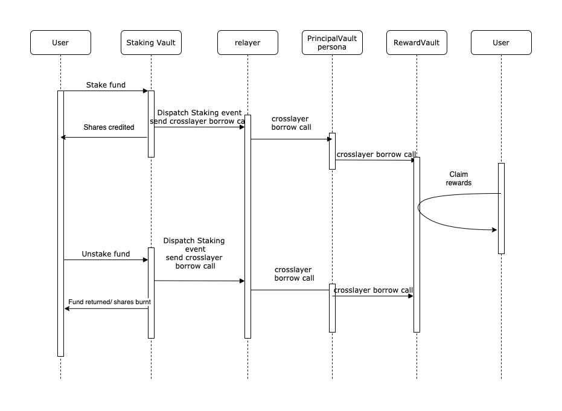

# DEMO 
In this demo, we are going to show how to interact with Mosaice crosslayer functionalities to stake on one network and receive reward on anther network 
## Preparation and instantiation of contracts.
For this demo, we have implemented a pair of Stacking and Reward Vault contracts which will be deployed in 2 different networks. The idea is to allow user deposit collateral in network 1 and receive staking rewards in a second network
Here are steps need to prepare the contracts: 

* Deploy ```StakingVault``` contract in Network 1
   ```
   const baseToken = ""; //staking token address
   const msgSender = ""; //msgsender address which will receive cross layer function calls located in network 1
  
   const stakingVault = await StackingVault.deploy(baseToken, msgSender);
   ```

* Deploy ```StakinglVault``` ```Persona``` contract in network 2, so StakingVault could communicate with RewardsVault without intermediary
   ```
   const stakingVault = ""; 
   const stakingVaultPersona = await MsgReceiverFactory.createPersona(stakingVault)
   ```
  
* Deploy ```RewardsVault``` contract in Network 2
   ```
   const rewardToken = ""; //reward token to be sent to user in network 2
   const msgSender = ""; //msgsender address which will receive cross layer function calls located in network 2
   const stakingVaultPersona = ""; //stakingVault Persona address deployed in l2
  
   releaseVault = await releaseVault.deploy(rewardToken, msgSender, stakingVaultPersona)
   ```

* Configure in stakingVault to set corresponding rewardVault to finalize the communication bridges setup
   ```
   const rewardVault = "" // releasse vault address deployed in network l2
   await stakingVault.setRewardVaultAddressByChainId(networkId2, rewardVault) 
   ```
  
* Now all communication bridges are configured, sending messages from stakingVault to rewardVault can be done seamlessly, from the contract perspectives operative permissions are configured in a way that only Persona contracts could interact to.
   ```
   // RewardVault contract
   function stake(uint256 _amount, address _to) external onlyReleaseVaultPersona;
   
   // RewardVault contract
   function unstake(uint256 _amount, address _to) external onlyStakingVaultPersona;
   ```

### Interaction
In the following flow chart we can see how we start a transaction from network 1 to make a deposit of certain erc20 token as staking token, then user could claim his rewards as long as the staking token remains in the staking contract.

